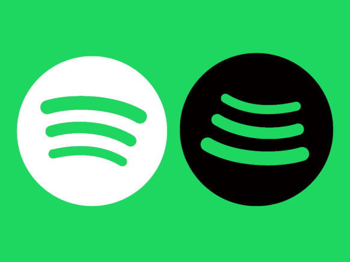

# spotify-playlist-converter
Convert your favourite Spotify-Playlists to Youtube-Playlists!

## Instructions
1. Make sure you have installed python on your system
2. Create a spotify client_id and client_secret (https://developer.spotify.com/dashboard/applications)
3. Create a google client_id and client_secret and enable the YouTube Data v3 API to generate an api_key (https://console.developers.google.com/)
4. Run `pip install -r requirements.txt` inside the cloned repository
5. Follow the setup instructions and enjoy your converted spotify playlists!

## Warning
Please keep in mind that the YouTube Data v3 API has a daily rate limit and you can only perform a certain amount of requests per day until the converter throws an error.
